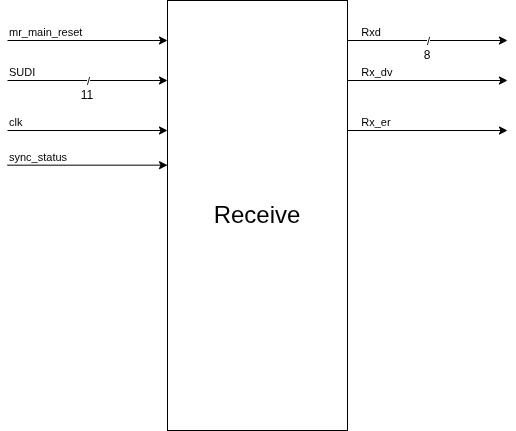
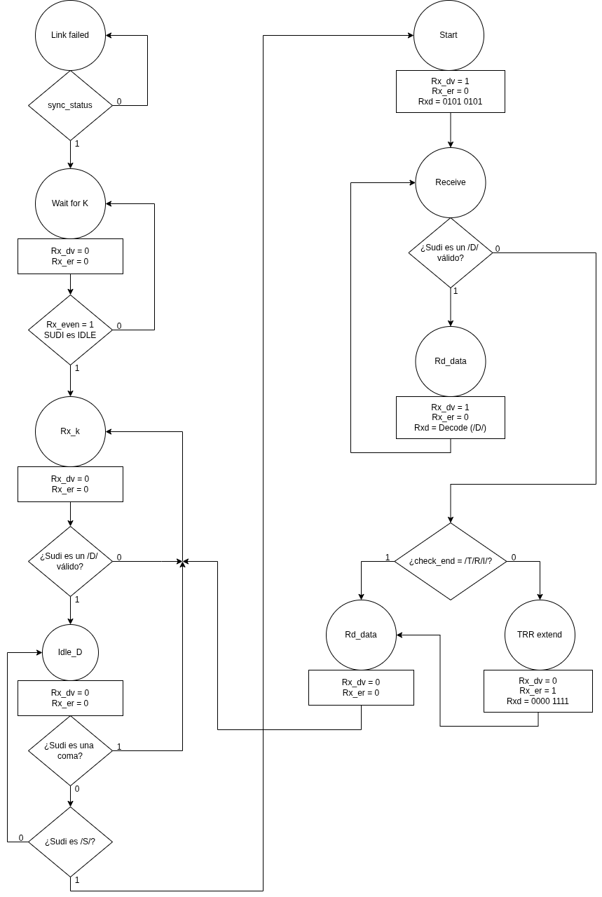

# RECEIVE
En el bloque de receive, se tiene el siguiente bloque para entender mejor las salidas y las entradas.

En donde cada señal tiene su significado e importancia

Nombre de la señal | Tipo |Descripción |
|:-------------------:|:------------:|-------------|
mr_main_reset | Entrada |Controla el reinicio del PCS, si mr_main_reset = 0 significa que no se reinicia el PCS, sin embargo, si se tiene mr_main_reset = 1 se reinicia el PCS.
SUDI [10:0]| Entrada |Señal enviada por el proceso de sincronización al proceso de recepción que contiene los parámetros del code_group y también el rx_even, el cual si rx_even = 1 significa que se recibe un grupo de códigos par, caso contrario se recibe un grupo de códigos impar.
clk | Entrada |Reloj con el que funciona el receptor para el envio de datos.
sync_status | Entrada |Si sync_status = 1, significa que se está sincronizado y que los datos que se van a recibir son fiables.
Rxd [7:0]| Salida |Es el valor que entrega el receptor a la interfaz GMII.
Rx_dv | Salida |Señal que indica que los valores de Rx son válidos.
Rx_er | Salida |Señal que indica que los valores de Rx contienen un error.

Ahora, para la máguina de estados se tienen planteados los siguientes estados, utilizando la codificación One-Hot

Estado | Codificación del estado |
:------:|:--------------------------:|
Link failed | 000000001
Wait for K | 000000010
Rx_K | 000000100
Idle_D | 000001000
Start | 000010000
Receive | 000100000
Rd_data | 001000000
TRR_Extend | 010000000
TRI_RRI | 100000000

Para el bloque de recepción se utilizará la máquina de estados que se presenta en el siguiente diagrama asm.

